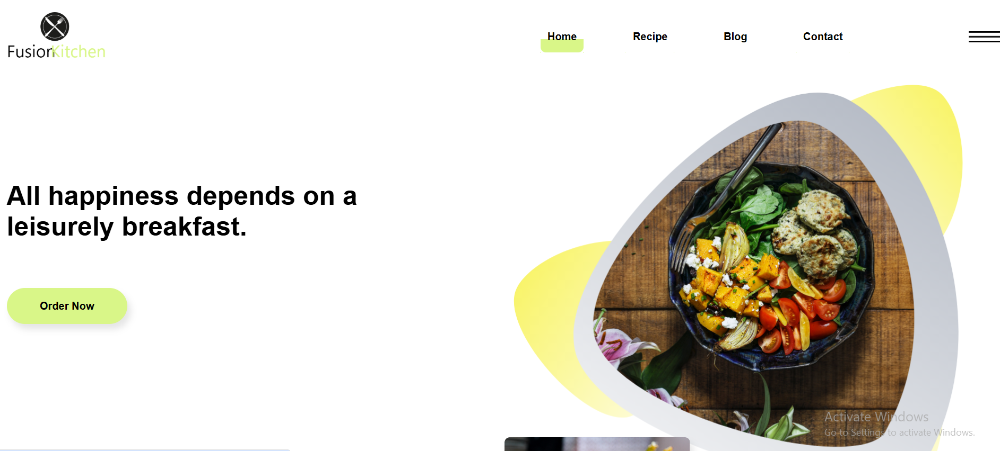

# UI resturanr Website

A simple website for a menu restaurant, built using HTML, CSS.

## Features
- Responsive design for mobile and desktop

## Live Demo
[Click here to view website](https://your-github-username.github.io/your-repo-name/)

## Screenshots

## Technologies Used
- HTML5
- CSS3
- Git & GitHub

## Author
- **Aya Ahmed Shawky**
- [LinkedIn](https://www.linkedin.com/in/aya-ahmed-15b114247/)
- [GitHub](https://github.com/ayaahmed222)
